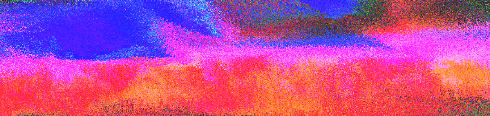

# Takahara dos Santos

[Chemistry](https://www.youtube.com/watch?v=RZWl7CMRmMc) undergraduate at the University of São Paulo (Brazil), interested in automation and instrumentation. Always starting a new project and collecting pieces of knowledge, from art to science.

*visual synth using [hydra](https://hydra.ojack.xyz/) :snake:* 

## Academic

Working at [FuNIILab](https://www.funiilab.com) under supervision of [Prof. Gabriel N. Meloni](https://www.funiilab.com/people) developing low-cost instrumentation for education and research!

---

  Icon made by Marcela de Souza Nogueira (peqs) 🐸

